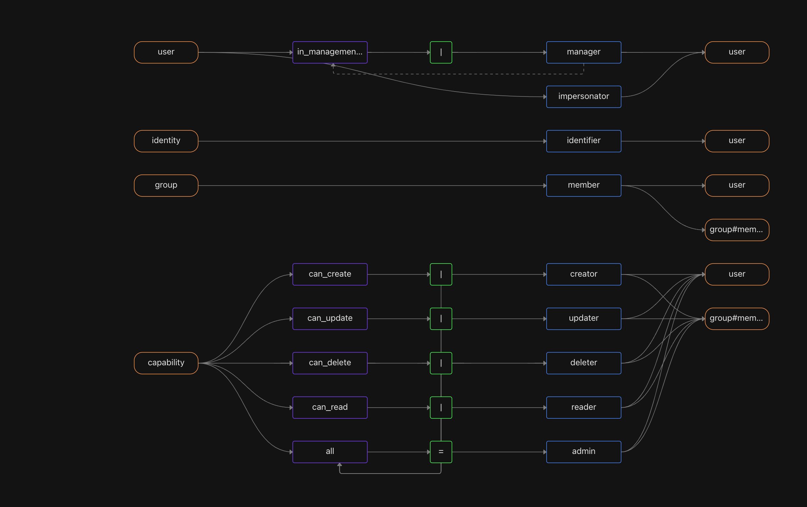
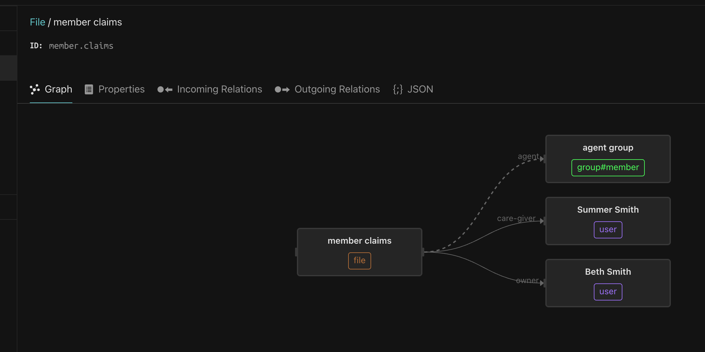
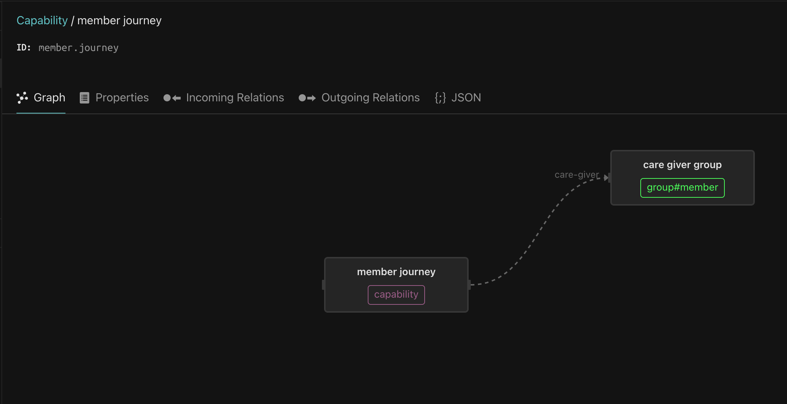
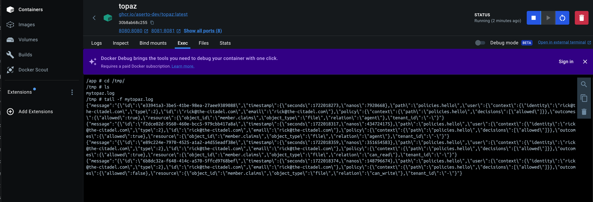

# Topaz Auth Engine Sidecar
## Introduction
> [Topaz](https://www.topaz.sh/docs/architecture) is an open-source, self-hosted, fine-grained access control service for modern cloud applications. It uses the Open Policy Agent (OPA) as its decision engine, and provides a built-in directory that implements the Google Zanzibar data model.

This repo deploys an `app` container along with the `topaz` container to do authz checks. The `topaz` container will be deployed as a standalone microservice.
## Deploy using `Makefile`
Use `make clean` to clean up the containers

Use `make run` ro run the containers.

Use `load-db` to load the manifest and the directory files. This needs to be done once before running any checks using the authorizer.

## Prerequisites to running Topaz Engine using `docker-compose`

- Use this to deploy topaz using docker-compose: https://www.topaz.sh/docs/deployment/docker-compose
- Make sure u copy over the asset to have a set of resources and users setup. Use it as a template. 
    
    ```bash
    policy templates apply policy-template
    ```
    
    - We then need to build that policy into an image using https://www.topaz.sh/docs/policies/lifecycle#build
    - Finally we we need to `export` this image into a tar file using https://www.topaz.sh/docs/command-line-interface/policy-cli/export
    
    The output of all that would look something like:
    
    ```bash
    ➜  test-policies git:(main) ✗ policy build ./src                           
    
    Created new image.
    digest: sha256:900c90346bd896cd1fd2af5703212ddfb811568a9631a66f73795f17b3a63ecf
    
    Tagging image.
    reference: docker.io/library/default:latest
    ➜  test-policies git:(main) ✗ policy images
    
      REPOSITORY                        TAG     IMAGE ID      CREATED               SIZE  
      docker.io/library/default         latest  900c90346bd8  2024-07-26T13:51:17Z  748B  
      docker.io/my-org/my-policy        v0.1.1  3d179cb14a7d  2024-07-26T13:46:02Z  750B  
      
    ➜  test-policies git:(main) ✗ policy save docker.io/my-org/my-policy:v0.1.1
    
    Resolved ref [docker.io/my-org/my-policy:v0.1.1].
    digest: sha256:7d94e2a7fb79807bf1d672b2347eee6fd902a4ffdb537a75dc8691a91ba0c161
    ➜  test-policies git:(main) ✗ ls
    README.md     bundle.tar.gz src
    ```
    
    - We then we need to edit the copy this tar over to the `policies` dir.
    - Then edit the `opa` section of the local.yaml file in the config dir to add local bundles like this example below and comment out the todo bundle coming from Aserto’s GHCR.
    
    ```yaml
    opa:
      instance_id: "-"
      graceful_shutdown_period_seconds: 2
      # max_plugin_wait_time_seconds: 30 set as default
      local_bundles:
        paths:
          /policies/bundle.tar.gz
        skip_verification: true
      config:
        services:
          ghcr:
            url: https://ghcr.io
            type: "oci"
            response_header_timeout_seconds: 5
        bundles:
          # todo:
          #   service: ghcr
          #   resource: "ghcr.io/aserto-policies/policy-todo:3.0.0"
          #   persist: false
          #   config:
          #     polling:
          #       min_delay_seconds: 60
          #       max_delay_seconds: 120
    
    ```
    

<aside>
💡 For other config.yaml examples: look at this https://github.com/aserto-dev/topaz/tree/main/docs/examples. Also see https://www.topaz.sh/docs/policies/configuration#configuring-private-registries that talks about how to setup access to private bundles.  To understand the full meaning of the config file, see https://github.com/aserto-dev/topaz/blob/main/docs/config.md

</aside>

- Next, hit `docker-compose up` to have the container running
- Finally, we may need to add Objects, Relations or Permissions to the Directory module in Topaz which allows us to create the various entities there exists.
    - For this, we need to edit the `manifest` and the `data/*.json` files to edit the graph and its properties
    - Then, we need to issue the following commands to apply it
    
    ```bash
    docker compose exec topaz ./topaz directory set manifest --no-check -i /data/manifest.yaml
    docker compose exec topaz ./topaz directory import --no-check -i -H localhost:9292 -d /data
    ```
    


If it all works out you should see this when trying to login to the topaz [dashboard](https://localhost:8080/ui/directory/model):
The current roles and permissions in the existing manifest file look like this:  The agent and care-giver groupings look like this based on the json files:  and  We can also add per resource(in this case, a `file`) to add per-resource level tweaks, See:  and 
- To edit the policy to add your own custom policy try using https://www.topaz.sh/docs/command-line-interface/policy-cli/download directly
    - you would need first build the create a template using

<aside>
👀 to clear all data in the DB, simply delete the bold.db instance in the `/db` directory. Restarting the container will create a new instance and then we simply need to reload the manifest, object and relations jsons using the `topaz directory` subcommand inside the container specified in https://www.topaz.sh/docs/deployment/docker-compose#load-sample-directory-data

</aside>
## Decision Logger

To enable a decision logger, we simply enable the following plugin in `opa` section of the config

and add a `decision_logger` config to the end of the config file

```yaml
opa:
  instance_id: "-"
  graceful_shutdown_period_seconds: 2
  # max_plugin_wait_time_seconds: 30 set as default
  local_bundles:
    paths:
      # []
      /policies/bundle.tar.gz
    skip_verification: true
  config:
    services:
      ghcr:
        url: https://ghcr.io
        type: "oci"
        response_header_timeout_seconds: 5
    bundles:
    plugins: # The new runtime plugin in OPA
      aserto_decision_log:
        enabled: true
decision_logger: #Finally, the new logs
  type: "file"
  config:
    log_file_path: /tmp/mytopaz.log
    max_file_size_mb: 50
    max_file_count: 2
```

The logs would show up like 

<aside>
👀 The docs for Decision Logger in Topaz official page is incorrect. The right config syntax can be found here: https://github.com/aserto-dev/topaz/blob/880152f5ec5fa064449525aa1bbf6be3ddd3e2a2/docs/config.md?plain=1#L249

</aside>


## The cURL 
To invoke the `GET /valid-agent` endpoint with a prefixed body we can use cURL
```
curl --location 'localhost:8888/valid-agent'
```

This can be used to trigger a `403` 
```
curl --location 'localhost:8888/invalid-agent'
```
Also, you try this to have the authz engine call an external function. If you look at the logs in `app` you can see the decorator logs shown.
```
curl --location 'localhost:8888/check-external'
```

If you want to interact with the Topaz directly, you can using this
```
curl -k --location 'https://localhost:8383/api/v2/authz/is' --header 'Content-Type: application/json' --data-raw '{
    "identity_context": {
        "identity": "rick@the-citadel.com",
        "type": "IDENTITY_TYPE_SUB"
    },
    "policy_context": {
        "decisions": [
            "allowed"
        ],
        "path": "policies.hello"
    },
    "resource_context": {
        "object_id": "member.claims",
        "object_type": "file",
        "relation": "can_read"
    }
}'
```
